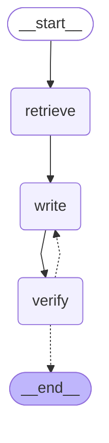

# Graphe de l'agent AeroDoc

Généré par `python src/ask_agent.py --mermaid docs/graph.md` à partir du graphe compilé (`src/agent/graph.py`).

- **retrieve** : recherche des passages (bge-m3 + pgvector, la même recherche qu'`ask.py`).
- **write** : le rédacteur écrit la réponse avec citations `[n]`, ou « Je ne trouve pas cette information dans les documents. » sans source. Au 2e essai, il reçoit le commentaire du vérificateur et son brouillon précédent.
- **verify** : le vérificateur renvoie `{"verdict": "ok" | "a_corriger", "probleme": "..."}`. Un JSON illisible est considéré comme `ok` et signalé dans les logs.
- Flèche en pointillés vers **write** : verdict `a_corriger` et moins de 2 essais. Sinon, fin : la réponse finale est le dernier brouillon.
