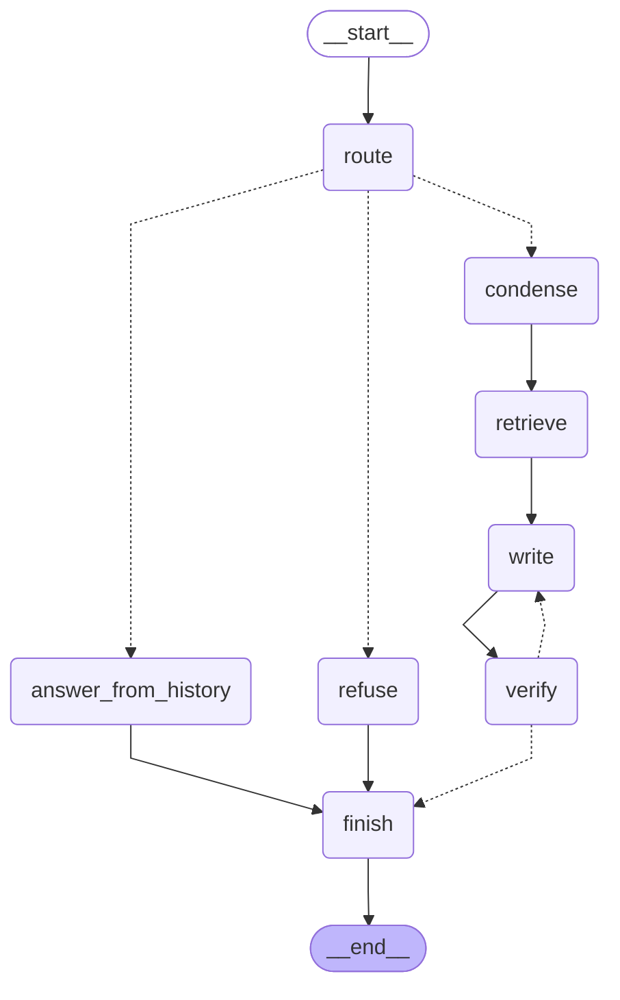

# Graphe de l'agent AeroDoc

Généré par `python src/ask_agent.py --mermaid docs/graph.md` à partir du graphe compilé (`src/agent/graph.py`).

- **route** : routeur à sortie structurée (schéma Pydantic `RouteDecision`) : `documents`, `conversation` ou `hors_perimetre`. En cas de doute ou d'échec : `documents`. Il voit les 10 derniers échanges.
- **condense** : reformule une relance (« et en 2023 ? », « reviens à ma première question ») en question autonome, à partir des 10 derniers échanges. Sans historique : aucun appel.
- **answer_from_history** : répond uniquement à partir de la conversation (« liste mes dernières questions »), sans recherche ni citation de PDF.
- **refuse** : hors périmètre, refus direct sans recherche ni appel LLM.
- **finish** : ajoute la réponse à la conversation (`messages`, conservés par le checkpointer `MemorySaver` par `thread_id` dans le chat).
- **retrieve** : recherche des passages (bge-m3 + pgvector, la même recherche qu'`ask.py`).
- **write** : le rédacteur écrit la réponse avec citations `[n]`, ou « Je ne trouve pas cette information dans les documents. » sans source. Au 2e essai, il reçoit le commentaire du vérificateur et son brouillon précédent.
- **verify** : le vérificateur renvoie `{"verdict": "ok" | "a_corriger", "probleme": "..."}`. Un JSON illisible est considéré comme `ok` et signalé dans les logs.
- Après **verify** : retour à **write** si verdict `a_corriger` et moins de 2 essais ; sinon **finish** : la réponse finale est le dernier brouillon.
